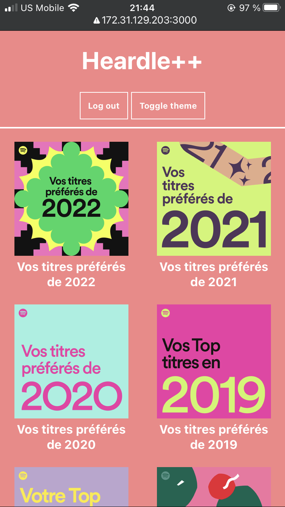

  
  <h1>Heardle++</h1>
  

    Heardle++ is an improved version of the web game Heardle, based on two core ideas:
    <ol>
      <li>The user should be able to quiz themselves on songs they might actually know - and not arbitrarily chosen "popular" Western songs.</li>
      <li>The user should be able to play as many times as they want, and not just once per day.</li>
    </ol>
  

  

    From these two ideas was born Heardle++, a music quiz web app where people with Spotify accounts, can log in, select any of their public, private, shared and liked playlists, and quiz themselves on their own library's songs, as many times as they want.
  

## About The Project

Here is a short video showing how Heardle++ works:

<!-- <video src="./readme-assets/heardle-plus-plus.mp4"> -->

## Technologies used
- The front-end was developed in React.
- The back-end consists of an Express server that handles the OAuth process.
- The Spotify Web API was used to retrieve the user's playlist and track data.

## Directory structure
- The Express code is in the `index.js` file at the top level.
- The React code is in the `./client/src/` directory, specifically in the `App.js` file.
- All React components are located in the `./client/src/components/` directory.

## Screenshots

Additionally, here are screenshots of the playlist selection, guessing, and results phases, for both desktop and mobile:

### Desktop

*Playlist selection phase on desktop*

*Guessing phase on desktop*

*Results phase on desktop*

### Mobile

*Playlist selection phase on mobile*

*Guessing phase on mobile*

*Results phase on mobile*

## Installation
1. Unzip heardle-plus-plus.zip
2. In the heardle-plus-plus directory, open your terminal and run `npm install`. This will install all the project's dependencies.
3. To run the React app, run `npm start`. This will automatically open a tab that points to `localhost:3000`, where Heardle++ runs.

*A Spotify account is required to fully use the app.*

*As this app is still in development, any user would have to contact me to be added to a list of authorised users.*

## Future improvements

In the foreseeable future, I would like to connect Heardle++ to other music streaming platform APIs, such as Apple Music's or Pandora's.

The end goal will be to make Heardle++ available to anyone, whether they have a music streaming subscription or not. This would probably involve storing some pre-selected genre- or artist-specific playlists in a database of some sort.
